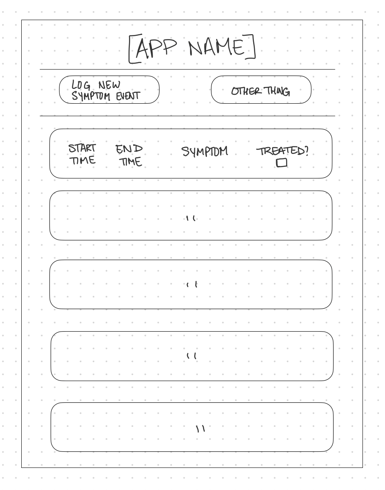

# PROJECT 2

- **Project Name: myZebraSymptoms Tracker**
- **Project By: Arielle Gironza**
- [**Link to GitHub**](https://github.com/akgironza/seir-kale-ariellegironza-project2)
- [**Link to Deployed Website**](https://seir-project2.onrender.com)
- **List of Technologies Used:** HTML, JS, CSS, Node, Express, EJS, MongoDB
- [**Link to Trello**](https://trello.com/invite/b/SxyL0cAL/ATTI4ee4b8b00b33b7ffa8b8292fd735788cBA827076/ga-seir-project2)

## Description
myZebraSymptom Tracker gives users living with chronic illness a place to log and track symptoms of their condition(s).

## Mockup of UI

## List of Backend Endpoints

|ENDPOINT|METHOD|PURPOSE|
|--------|------|-------|
|/symptoms|GET|INDEX - show all symptomatic events|
|/symptoms/new|GET|NEW - render a page with a form to log a new symptomatic event, submits form to CREATE route|
|/symptoms/:id|DELETE|DESTROY - delete a logged symptomatic event from database|
|/symptoms/:id|PUT|UPDATE - receives info from EDIT route, update specified symptomatic event|
|/symptoms|POST|CREATE - receives info from NEW route, create new symptomatic event in database|
|/symptoms/:id/edit|GET|EDIT - render a page with a form to edit a logged symptomatic event, submits form to UPDATE route|
|/symptoms/:id|GET|SHOW - render a page with the specified symptomatic event|

## ERD (ENTITY-RELATIONSHIP DIAGRAM)

